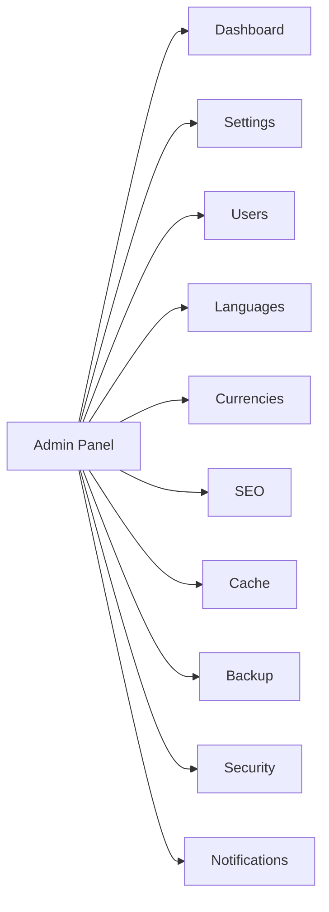

## 📄 **فایل کامل `README.md` - نسخه حرفه‌ای و مدرن**

```markdown
<p align="center">
  
</p>

<h1 align="center">💱 Exchange Rates - PWA Web Application</h1>

<p align="center">
  <strong>یک وب‌اپلیکیشن کامل، آفلاین و چندزبانه برای مشاهده نرخ لحظه‌ای ارز بانک مرکزی ایران</strong>
</p>

<p align="center">
  <a href="https://mozili.ir/arz/"></a>
  <a href="https://github.com/rmombeni/exchange-rates-pwa"></a>
  <a href="https://reymit.ir/rmombeni"></a>
</p>

<p align="center">
  <a href="https://php.net"></a>
  <a href="https://web.dev/progressive-web-apps/"></a>
  <a href="LICENSE"></a>
  <a href="CONTRIBUTING.md"></a>
</p>

<br>

---

## 🌟 **Table of Contents**

- [✨ Features](#-features)
- [🌐 Languages](#-languages)
- [📸 Screenshots](#-screenshots)
- [🚀 Quick Start](#-quick-start)
- [📁 Project Structure](#-project-structure)
- [🛠️ Technologies](#️-technologies)
- [🔑 Admin Panel](#-admin-panel)
- [⚙️ Configuration](#️-configuration)
- [🤝 Contributing](#-contributing)
- [📜 License](#-license)
- [💖 Support](#-support)

---

## ✨ **Features**

<div align="center">

| 🎯 Core Features | 🎨 UI/UX | 🔧 Tools |
|------------------|----------|----------|
| ✅ Real-time 46+ rates | ✅ Glassmorphism Design | ✅ Live Search |
| ✅ Auto-update (5 min) | ✅ Dark/Light Mode | ✅ Table Sorting |
| ✅ Server Caching | ✅ Vazir Font (Local) | ✅ Rial/Toman Convert |
| ✅ 30-Day History | ✅ Fully Responsive | ✅ Currency Converter |
| ✅ PWA Installable | ✅ RTL/LTR Support | ✅ Chart & Graph |
| ✅ Offline Support | ✅ 5 Languages | ✅ CSV Export |

</div>

### 🛡️ **Complete Admin Panel**

| Section | Features |
|---------|----------|
| 👥 **Users** | Add, Edit, Delete, Activate/Deactivate Users |
| 🌍 **Languages** | Add, Edit, Delete, Toggle Languages |
| 💰 **Currencies** | Manage Major Currencies |
| ⚙️ **Settings** | Site Name, Description, SEO, Social Networks |
| 🗄️ **Cache** | Enable/Disable, Clear Cache |
| 💾 **Backup** | Create, Restore, Delete Backups |
| 🔔 **Notifications** | Email, Browser, Sound Alerts |
| 🛡️ **Security** | Change Password, Admin Info |

### ⌨️ **Keyboard Shortcuts**

| Key | Action |
|-----|--------|
| `Ctrl + Shift + D` | Toggle Dark/Light Mode |
| `Ctrl + F` | Focus on Search |
| `Ctrl + Shift + S` | Toggle Sidebar (Admin) |
| `Esc` | Close Modals |

---

## 🌐 **Languages**

<div align="center">

| Language | Code | Flag | Status |
|----------|------|------|--------|
| فارسی (Persian) | `fa` | 🇮🇷 | ✅ Active |
| English | `en` | 🇬🇧 | ✅ Active |
| العربية (Arabic) | `ar` | 🇸🇦 | ✅ Active |
| Türkçe (Turkish) | `tr` | 🇹🇷 | ✅ Active |
| Español (Spanish) | `es` | 🇪🇸 | ✅ Active |

</div>

> **💡 Easy to add new languages!** Just add a new language object to `config/languages.json`

---

## 📸 **Screenshots**

<div align="center">

| Light Mode | Dark Mode |
|------------|-----------|
|  |  |

| Admin Panel | Mobile View |
|-------------|-------------|
|  |  |

</div>

---

## 🚀 **Quick Start**

### 📋 **Prerequisites**

```bash
PHP 7.4+          # Backend
cURL Extension    # API calls
SimpleXML         # RSS parsing
JSON Extension    # Configuration
Web Server        # Apache/Nginx
```

### ⚡ **Installation**

```bash
# 1. Clone the repository
git clone https://github.com/rmombeni/exchange-rates-pwa.git
cd exchange-rates-pwa

# 2. Set permissions
chmod 755 cache/ history/ backup/ logs/ config/

# 3. Place Vazir font in fonts/ folder
# Download from: https://github.com/rastikerdar/vazir-font

# 4. Open in browser
# http://localhost/exchange-rates-pwa/
```

### 🐳 **Docker Installation**

```bash
# Build the image
docker build -t exchange-rates .

# Run the container
docker run -p 8080:80 exchange-rates

# Open in browser: http://localhost:8080
```

---

## 📁 **Project Structure**

```
exchange-rates-pwa/
│
├── 📂 admin/                    # Admin Panel
│   ├── index.php                # Dashboard
│   ├── login.php                # Login Page
│   ├── logout.php               # Logout
│   └── users.php                # User Management
│
├── 📂 config/                   # Configuration
│   ├── settings.json            # Main Settings
│   ├── languages.json           # Multi-language
│   └── users.json               # Users Database
│
├── 📂 includes/                 # Core Files
│   ├── config.php               # Config Loader
│   ├── functions.php            # Helper Functions
│   └── user_functions.php       # User Functions
│
├── 📂 fonts/                    # Fonts
│   └── Vazir.ttf                # Persian Font
│
├── 📂 icons/                    # PWA Icons
│   ├── icon-72.png
│   ├── icon-96.png
│   ├── icon-128.png
│   ├── icon-144.png
│   ├── icon-152.png
│   ├── icon-192.png
│   ├── icon-384.png
│   └── icon-512.png
│
├── 📂 cache/                    # Cache (Auto-generated)
├── 📂 history/                  # Rate History (Auto-generated)
├── 📂 backup/                   # Backups (Auto-generated)
├── 📂 logs/                     # Logs (Auto-generated)
│
├── 📄 index.php                 # Main Page
├── 📄 history.php               # Chart History API
├── 📄 manifest.json             # PWA Manifest
├── 📄 sw.js                     # Service Worker
├── 📄 .htaccess                 # Server Config
├── 📄 robots.txt                # SEO
├── 📄 sitemap.xml               # Sitemap
│
├── 📄 404.html                  # 404 Error Page
├── 📄 500.html                  # 500 Error Page
├── 📄 contact.html              # Contact Page
│
└── 📄 README.md                 # This File
```

---

## 🛠️ **Technologies**

<div align="center">

| Technology | Purpose |
|------------|---------|
|  | Backend & Logic |
|  | Structure |
|  | Styling |
|  | Interactions |
|  | Charts |
|  | Icons |
|  | Progressive Web App |
|  | Database |

</div>

---

## 🔑 **Admin Panel**

### 🔐 **Login Credentials**

| Item | Value |
|------|-------|
| **URL** | `https://yourdomain.com/arz/admin/login.php` |
| **Username** | `admin` |
| **Password** | `Admin@2026` |

> ⚠️ **Security Alert:** Change the password immediately after first login!

### 🎯 **Admin Features**



---

## ⚙️ **Configuration**

### 📝 **Cache Time**

```php
// In includes/config.php
define('CACHE_TIME', 300); // 300 seconds = 5 minutes
```

### 💰 **Major Currencies**

```json
// In config/settings.json
"major": ["USD", "EUR", "GBP", "CHF", "CAD", "AED", "TRY"]
```

### 🎨 **Theme Colors**

```css
/* In CSS :root variables */
--bg-header: #0a2540;
--success: #1a7a4a;
--danger: #c0392b;
--warning: #ffc107;
```

---

## 🤝 **Contributing**

We welcome contributions! Here's how you can help:

### 📋 **Ways to Contribute**

- 🐛 **Report Bugs** - Open an issue with detailed description
- ✨ **Suggest Features** - Share your ideas
- 📝 **Improve Documentation** - Fix typos, add examples
- 💻 **Submit PRs** - Fix issues or add features

### 🔧 **Development Setup**

```bash
# 1. Fork the repository
# 2. Clone your fork
git clone https://github.com/yourusername/exchange-rates-pwa.git

# 3. Create a branch
git checkout -b feature/your-feature

# 4. Make your changes
# 5. Commit with conventional message
git commit -m "feat: add new feature"

# 6. Push to your fork
git push origin feature/your-feature

# 7. Open a Pull Request
```

### 📝 **Commit Convention**

```
feat: add new currency converter
fix: resolve chart loading issue
docs: update README with new features
style: improve admin panel UI
refactor: optimize database queries
test: add unit tests for user functions
chore: update dependencies
```

---

## 📜 **License**

<div align="center">

```
MIT License

Copyright (c) 2024 R.Mombeni

Permission is hereby granted, free of charge, to any person obtaining a copy
of this software and associated documentation files (the "Software"), to deal
in the Software without restriction...
```

</div>

---

## 💖 **Support**

If you find this project helpful, please consider supporting us:

<div align="center">

| Support Method | Link |
|----------------|------|
| ☕ **Donation** | [reymit.ir/rmombeni](https://reymit.ir/rmombeni) |
| ⭐ **Star on GitHub** | [Give a Star ⭐](https://github.com/rmombeni/exchange-rates-pwa) |
| 🔄 **Share** | Share with your network |
| 🐛 **Report Issues** | [Open an Issue](https://github.com/rmombeni/exchange-rates-pwa/issues) |

</div>

---

## 📊 **Project Stats**

<div align="center">

[](https://github.com/rmombeni/exchange-rates-pwa)
[](https://github.com/rmombeni/exchange-rates-pwa)
[](https://github.com/rmombeni/exchange-rates-pwa)
[](https://github.com/rmombeni/exchange-rates-pwa/issues)
[](https://github.com/rmombeni/exchange-rates-pwa)

</div>

---

## 📞 **Contact & Connect**

<div align="center">

| Platform | Link |
|----------|------|
| 🌐 **Website** | [mozili.ir](https://mozili.ir/) |
| 🐙 **GitHub** | [rmombeni](https://github.com/rmombeni) |
| 📧 **Email** | admin@mozili.ir |
| ☕ **Support** | [reymit.ir/rmombeni](https://reymit.ir/rmombeni) |

</div>

---

<div align="center">

---

**⭐⭐⭐ If you like this project, please give it a star! ⭐⭐⭐**

---

<p align="center">
  
</p>

**Made with ❤️ by [R.Mombeni](https://github.com/rmombeni)**

*For the Iranian Community 🇮🇷*

---

</div>

<!-- ============================================ -->
<!-- 🇮🇷 Persian Version (فارسی) -->
<!-- ============================================ -->

---

<h1 align="center">💱 نرخ ارز مرجع - وب‌اپلیکیشن PWA</h1>

<p align="center">
  <strong>یک وب‌اپلیکیشن کامل، آفلاین و چندزبانه برای مشاهده نرخ لحظه‌ای ارز بانک مرکزی ایران</strong>
</p>

<p align="center">
  <a href="https://mozili.ir/arz/"></a>
  <a href="https://github.com/rmombeni/exchange-rates-pwa"></a>
  <a href="https://reymit.ir/rmombeni"></a>
</p>

---

## ✨ **ویژگی‌ها**

### 🎯 **امکانات اصلی**

- ✅ **نمایش لحظه‌ای** نرخ ۴۶+ ارز رسمی بانک مرکزی
- ✅ **آپدیت خودکار** هر ۵ دقیقه
- ✅ **کش سمت سرور** برای کاهش بار
- ✅ **تاریخچه نرخ‌ها** (۳۰ روز اخیر)
- ✅ **قابل نصب** روی گوشی و کامپیوتر (PWA)
- ✅ **آفلاین** با Service Worker

### 🎨 **رابط کاربری**

- ✅ **طراحی مدرن** با افکت شیشه‌ای (Glassmorphism)
- ✅ **دارک/لایت مود** با کلید میانبر `Ctrl+Shift+D`
- ✅ **فونت وزیر** (لوکال، بدون نیاز به اینترنت)
- ✅ **کاملاً ریسپانسیو** (موبایل، تبلت، دسکتاپ)
- ✅ **پشتیبانی از ۵ زبان** (فارسی، انگلیسی، عربی، ترکی، اسپانیایی)

### 🔧 **ابزارها**

- ✅ **جستجوی زنده** با فیلتر کردن جدول
- ✅ **مرتب‌سازی جدول** با کلیک روی ستون‌ها
- ✅ **تبدیل ریال به تومان** با یک کلیک
- ✅ **مبدل ارز** (تبدیل دو ارز به هم)
- ✅ **نمودار تغییرات** (۳۰ روز اخیر)
- ✅ **نمایش تغییرات درصدی** (نسبت به روز قبل)
- ✅ **خروجی CSV** (دانلود داده‌های جدول)

### 🛡️ **پنل مدیریت کامل**

| بخش | امکانات |
|------|---------|
| 👥 **کاربران** | افزودن، ویرایش، حذف، فعال/غیرفعال |
| 🌍 **زبان‌ها** | افزودن، ویرایش، حذف، فعال/غیرفعال |
| 💰 **ارزها** | مدیریت ارزهای شاخص |
| ⚙️ **تنظیمات** | نام سایت، توضیحات، سئو، شبکه‌های اجتماعی |
| 🗄️ **کش** | فعال/غیرفعال، پاکسازی کش |
| 💾 **بکاپ** | ایجاد، بازیابی، حذف بکاپ |
| 🔔 **نوتیفیکیشن** | ایمیل، مرورگر، صدا |
| 🛡️ **امنیت** | تغییر رمز عبور، اطلاعات ادمین |

---

## 🚀 **نصب سریع**

```bash
# 1. کلون کردن مخزن
git clone https://github.com/rmombeni/exchange-rates-pwa.git
cd exchange-rates-pwa

# 2. تنظیم دسترسی‌ها
chmod 755 cache/ history/ backup/ logs/ config/

# 3. قرار دادن فونت وزیر در پوشه fonts/
# دانلود از: https://github.com/rastikerdar/vazir-font

# 4. اجرا در مرورگر
# http://localhost/exchange-rates-pwa/
```

---

## 🔑 **ورود به پنل مدیریت**

| مورد | مقدار |
|------|-------|
| **آدرس پنل** | `https://yourdomain.com/arz/admin/login.php` |
| **نام کاربری** | `admin` |
| **رمز عبور** | `Admin@2026` |

> ⚠️ **توصیه امنیتی:** حتماً بعد از اولین ورود، رمز عبور را تغییر دهید!

---

## 🤝 **مشارکت**

1. **فورک** کنید
2. **برنچ** جدید ایجاد کنید (`git checkout -b feature/AmazingFeature`)
3. **کامیت** کنید (`git commit -m 'Add some AmazingFeature'`)
4. **پوش** کنید (`git push origin feature/AmazingFeature`)
5. **Pull Request** باز کنید

---

## 💖 **حمایت**

اگر این پروژه برای شما مفید بود، لطفاً از ما حمایت کنید:

| روش حمایت | لینک |
|-----------|------|
| ☕ **کمک مالی** | [reymit.ir/rmombeni](https://reymit.ir/rmombeni) |
| ⭐ **ستاره در گیت‌هاب** | [Give a Star ⭐](https://github.com/rmombeni/exchange-rates-pwa) |
| 🔄 **اشتراک‌گذاری** | با دیگران به اشتراک بگذارید |

---

<div align="center">

---

**ساخته شده با ❤️ برای جامعه ایرانی** 🇮🇷

**[R.Mombeni](https://github.com/rmombeni)**

---

</div>

<!-- ============================================ -->
<!-- 🇸🇦 Arabic Version (العربية) -->
<!-- ============================================ -->

---

<h1 align="center">💱 أسعار الصرف - تطبيق ويب PWA</h1>

<p align="center">
  <strong>تطبيق ويب كامل، غير متصل ومتعدد اللغات لعرض أسعار الصرف لحظياً من البنك المركزي الإيراني</strong>
</p>

<p align="center">
  <a href="https://mozili.ir/arz/"></a>
  <a href="https://github.com/rmombeni/exchange-rates-pwa"></a>
</p>

---

## ✨ **الميزات**

- ✅ **عرض لحظي** لأسعار ٤٦+ عملة رسمية
- ✅ **تحديث تلقائي** كل ٥ دقائق
- ✅ **تخزين مؤقت** لتقليل الحمل
- ✅ **تاريخ الأسعار** (آخر ٣٠ يوم)
- ✅ **قابل للتثبيت** PWA
- ✅ **وضع غير متصل** مع Service Worker
- ✅ **تصميم حديث** مع تأثير الزجاج
- ✅ **وضع مظلم/فاتح**
- ✅ **دعم ٥ لغات**
- ✅ **لوحة إدارة كاملة**

---

## 🚀 **التثبيت**

```bash
git clone https://github.com/rmombeni/exchange-rates-pwa.git
cd exchange-rates-pwa
chmod 755 cache/ history/ backup/ logs/ config/
```

---

## 🔑 **تسجيل الدخول**

| العنصر | القيمة |
|--------|--------|
| **رابط لوحة الإدارة** | `https://yourdomain.com/arz/admin/login.php` |
| **اسم المستخدم** | `admin` |
| **كلمة المرور** | `Admin@2026` |

---

<div align="center">

**صنع بحب ❤️ للمجتمع الإيراني** 🇸🇦

**[R.Mombeni](https://github.com/rmombeni)**

</div>

<!-- ============================================ -->
<!-- 🇹🇷 Turkish Version (Türkçe) -->
<!-- ============================================ -->

---

<h1 align="center">💱 Döviz Kurları - PWA Web Uygulaması</h1>

<p align="center">
  <strong>İran Merkez Bankası resmi döviz kurlarını görüntülemek için tam, çevrimdışı ve çok dilli bir PWA web uygulaması</strong>
</p>

<p align="center">
  <a href="https://mozili.ir/arz/"></a>
  <a href="https://github.com/rmombeni/exchange-rates-pwa"></a>
</p>

---

## ✨ **Özellikler**

- ✅ **Gerçek zamanlı** 46+ resmi döviz kuru
- ✅ **Otomatik güncelleme** her 5 dakikada
- ✅ **Sunucu önbelleği** yükü azaltmak için
- ✅ **Kur geçmişi** (son 30 gün)
- ✅ **Kurulabilir** PWA
- ✅ **Çevrimdışı** Service Worker ile
- ✅ **Modern tasarım** Cam efekti ile
- ✅ **Karanlık/Aydınlık mod**
- ✅ **5 dil desteği**
- ✅ **Tam yönetim paneli**

---

## 🚀 **Kurulum**

```bash
git clone https://github.com/rmombeni/exchange-rates-pwa.git
cd exchange-rates-pwa
chmod 755 cache/ history/ backup/ logs/ config/
```

---

## 🔑 **Giriş**

| Öğe | Değer |
|-----|-------|
| **Yönetim Paneli URL** | `https://yourdomain.com/arz/admin/login.php` |
| **Kullanıcı Adı** | `admin` |
| **Şifre** | `Admin@2026` |

---

<div align="center">

**❤️ İran topluluğu için sevgiyle yapıldı** 🇹🇷

**[R.Mombeni](https://github.com/rmombeni)**

</div>

<!-- ============================================ -->
<!-- 🇪🇸 Spanish Version (Español) -->
<!-- ============================================ -->

---

<h1 align="center">💱 Tipos de Cambio - Aplicación Web PWA</h1>

<p align="center">
  <strong>Una aplicación web PWA completa, sin conexión y multilingüe para ver tipos de cambio en tiempo real del Banco Central de Irán</strong>
</p>

<p align="center">
  <a href="https://mozili.ir/arz/"></a>
  <a href="https://github.com/rmombeni/exchange-rates-pwa"></a>
</p>

---

## ✨ **Características**

- ✅ **Visualización en tiempo real** de 46+ tipos de cambio oficiales
- ✅ **Actualización automática** cada 5 minutos
- ✅ **Caché del lado del servidor** para reducir carga
- ✅ **Historial de tasas** (últimos 30 días)
- ✅ **Instalable** PWA
- ✅ **Sin conexión** con Service Worker
- ✅ **Diseño moderno** con efecto Glassmorphism
- ✅ **Modo oscuro/claro**
- ✅ **Soporte para 5 idiomas**
- ✅ **Panel de administración completo**

---

## 🚀 **Instalación**

```bash
git clone https://github.com/rmombeni/exchange-rates-pwa.git
cd exchange-rates-pwa
chmod 755 cache/ history/ backup/ logs/ config/
```

---

## 🔑 **Inicio de Sesión**

| Elemento | Valor |
|----------|-------|
| **URL del Panel** | `https://yourdomain.com/arz/admin/login.php` |
| **Usuario** | `admin` |
| **Contraseña** | `Admin@2026` |

---

<div align="center">

**Hecho con ❤️ para la comunidad iraní** 🇪🇸

**[R.Mombeni](https://github.com/rmombeni)**

</div>

---

<!-- ============================================ -->
<!-- 📊 COMMON FOOTER -->
<!-- ============================================ -->

<div align="center">

## 📊 **Project Statistics**

[](https://github.com/rmombeni/exchange-rates-pwa)
[](https://github.com/rmombeni/exchange-rates-pwa)
[](https://github.com/rmombeni/exchange-rates-pwa)
[](https://github.com/rmombeni/exchange-rates-pwa)

---

## 📞 **Contact & Connect**

| Platform | Link |
|----------|------|
| 🌐 **Website** | [mozili.ir](https://mozili.ir/) |
| 🐙 **GitHub** | [rmombeni](https://github.com/rmombeni) |
| 📧 **Email** | admin@mozili.ir |
| ☕ **Support** | [reymit.ir/rmombeni](https://reymit.ir/rmombeni) |

---

## ⭐ **Show Your Support**

> **If you find this project useful, please consider giving it a star! ⭐**

[](https://github.com/rmombeni/exchange-rates-pwa)

---

<p align="center">
  
</p>

**Made with ❤️ by [R.Mombeni](https://github.com/rmombeni)**

*For the Global Community 🌍*
